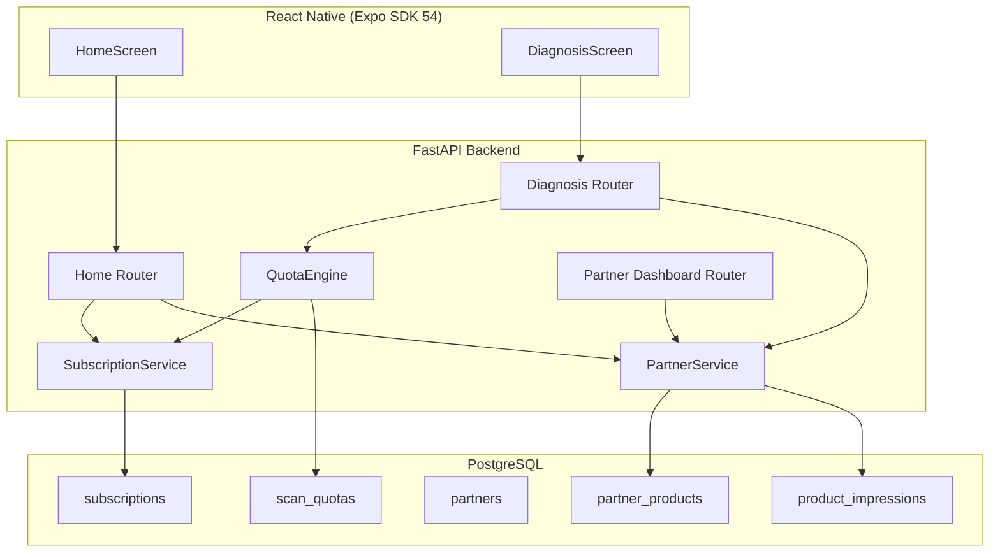
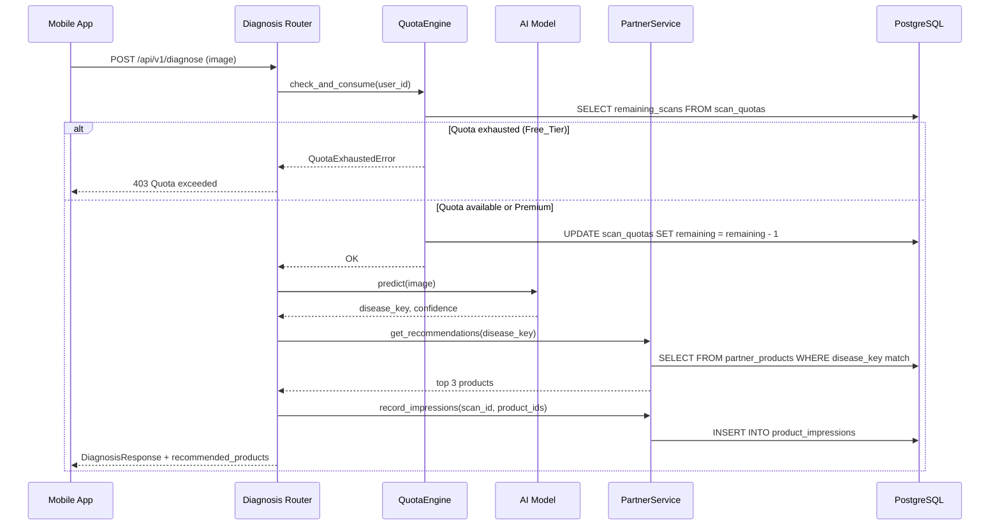
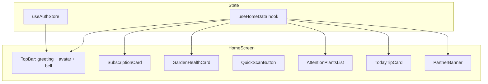

# Design Document: Subscription & Partners

## Overview

This design covers the **Subscription & Partners** feature for LeafScan AI, adding three major capabilities:

1. **Subscription System** — Tiered access control (Free/Premium) with daily scan quotas
2. **Partner Portal** — Partner registration, product management, and product recommendations in diagnosis results
3. **Home Screen Redesign** — Extended home API and mobile component architecture to display subscription status and partner products

The design integrates with the existing FastAPI backend (SQLAlchemy + PostgreSQL), the React Native mobile app (Expo SDK 54), and the current diagnosis pipeline.

### Key Design Decisions

| Decision | Rationale |
|----------|-----------|
| Database-backed quota (not in-memory) | Survives restarts, works across multiple workers |
| Quota stored per-user row (not per-scan counting) | O(1) check per scan vs O(n) count query |
| Partner products embedded in diagnosis response | Single round-trip for mobile; no extra API call |
| Home API extended (not new endpoint) | Backward compatible; single request for all home data |
| Scheduled quota reset via cron/celery-beat | Reliable daily reset at 00:00 UTC+7 |

---

## Architecture



### Data Flow: Diagnosis with Quota + Product Recommendations



---

## Components and Interfaces

### 1. SubscriptionService (`backend/app/services/subscription_service.py`)

```python
class SubscriptionService:
    def get_user_subscription(self, db: Session, user_id: int) -> Subscription
    def assign_free_tier(self, db: Session, user_id: int) -> Subscription
    def upgrade_to_premium(self, db: Session, user_id: int, expires_at: datetime) -> Subscription
    def check_and_downgrade_expired(self, db: Session) -> int  # returns count downgraded
    def get_subscription_status(self, db: Session, user_id: int) -> SubscriptionStatusDTO
```

### 2. QuotaEngine (`backend/app/services/quota_engine.py`)

```python
class QuotaEngine:
    def check_and_consume(self, db: Session, user_id: int) -> bool
    """Returns True if scan allowed. Decrements quota for Free_Tier. Raises QuotaExhaustedError if 0."""
    
    def get_remaining(self, db: Session, user_id: int) -> int | None
    """Returns remaining scans (None = unlimited for Premium)."""
    
    def reset_daily_quotas(self, db: Session) -> int
    """Resets all Free_Tier quotas to 5. Returns count of users reset."""
    
    def record_consumption(self, db: Session, user_id: int, scan_id: int) -> None
    """Records audit entry for scan consumption."""
```

### 3. PartnerService (`backend/app/services/partner_service.py`)

```python
class PartnerService:
    # Partner management
    def register_partner(self, db: Session, data: PartnerRegistrationDTO) -> Partner
    def approve_partner(self, db: Session, partner_id: int) -> Partner
    def update_partner_profile(self, db: Session, partner_id: int, data: PartnerUpdateDTO) -> Partner
    
    # Product management
    def create_product(self, db: Session, partner_id: int, data: ProductCreateDTO) -> PartnerProduct
    def update_product(self, db: Session, product_id: int, data: ProductUpdateDTO) -> PartnerProduct
    def toggle_product_active(self, db: Session, product_id: int, active: bool) -> PartnerProduct
    def get_partner_products(self, db: Session, partner_id: int) -> list[PartnerProduct]
    
    # Recommendation engine
    def get_recommendations(self, db: Session, disease_key: str, limit: int = 3) -> list[PartnerProduct]
    def record_impressions(self, db: Session, scan_id: int, product_ids: list[int]) -> None
    
    # Statistics
    def get_partner_stats(self, db: Session, partner_id: int, start_date: date, end_date: date) -> PartnerStatsDTO
```

### 4. API Endpoints

#### Subscription Router (`/api/v1/subscription`)

| Method | Path | Description | Auth |
|--------|------|-------------|------|
| GET | `/api/v1/subscription/status` | Get current subscription status | User |
| POST | `/api/v1/subscription/upgrade` | Upgrade to Premium | User |

#### Partner Router (`/api/v1/partners`)

| Method | Path | Description | Auth |
|--------|------|-------------|------|
| POST | `/api/v1/partners/register` | Register new partner | Public |
| PUT | `/api/v1/partners/{id}/profile` | Update partner profile | Partner |
| POST | `/api/v1/partners/{id}/approve` | Approve partner (admin) | Admin |
| GET | `/api/v1/partners/{id}/products` | List partner products | Partner |
| POST | `/api/v1/partners/{id}/products` | Create product listing | Partner |
| PUT | `/api/v1/partners/products/{product_id}` | Update product | Partner |
| PATCH | `/api/v1/partners/products/{product_id}/toggle` | Activate/deactivate | Partner |
| GET | `/api/v1/partners/{id}/stats` | Get impression stats | Partner |

#### Extended Home API (`/api/home/summary`)

The existing endpoint is extended with two new fields in the response:

```json
{
  "success": true,
  "data": {
    "user": { ... },
    "stats": { ... },
    "today_tip": { ... },
    "attention_plants": [ ... ],
    "recent_scans": [ ... ],
    "subscription": {
      "tier": "free",
      "remaining_scans": 3,
      "expires_at": null
    },
    "featured_products": [
      {
        "id": 1,
        "name": "Phân bón NPK 20-20-15",
        "image_url": "https://...",
        "partner_name": "Công ty ABC",
        "product_url": "https://..."
      }
    ]
  }
}
```

### 5. Mobile Component Architecture



| Component | Props | Description |
|-----------|-------|-------------|
| `SubscriptionCard` | `tier, remainingScans, expiresAt` | Shows tier badge, quota bar, upgrade CTA |
| `GardenHealthCard` | `averageHealth, attentionCount` | Circular progress + attention count |
| `QuickScanButton` | `onPress, disabled` | Prominent scan CTA; disabled when quota = 0 |
| `AttentionPlantsList` | `plants[]` | Horizontal FlatList with plant cards |
| `TodayTipCard` | `tip` | Card with title, summary, category icon |
| `PartnerBanner` | `products[]` | Horizontal carousel of up to 2 products |
| `SkeletonHome` | — | Skeleton placeholders for loading state |

---

## Data Models

### New Database Tables

#### `subscriptions`

| Column | Type | Constraints | Description |
|--------|------|-------------|-------------|
| id | Integer | PK, auto-increment | |
| user_id | Integer | FK → users.id, UNIQUE, NOT NULL | One subscription per user |
| tier | String(20) | NOT NULL, DEFAULT 'free' | 'free' or 'premium' |
| started_at | DateTime(tz) | NOT NULL, server_default=now() | When current tier started |
| expires_at | DateTime(tz) | NULLABLE | NULL for free tier; expiration for premium |
| created_at | DateTime(tz) | NOT NULL, server_default=now() | |
| updated_at | DateTime(tz) | NOT NULL, onupdate=now() | |

#### `scan_quotas`

| Column | Type | Constraints | Description |
|--------|------|-------------|-------------|
| id | Integer | PK, auto-increment | |
| user_id | Integer | FK → users.id, UNIQUE, NOT NULL | One quota record per user |
| remaining_scans | Integer | NOT NULL, DEFAULT 5 | Remaining daily scans (ignored for premium) |
| last_reset_at | DateTime(tz) | NOT NULL, server_default=now() | Last quota reset timestamp |
| updated_at | DateTime(tz) | NOT NULL, onupdate=now() | |

#### `scan_consumptions` (audit table)

| Column | Type | Constraints | Description |
|--------|------|-------------|-------------|
| id | Integer | PK, auto-increment | |
| user_id | Integer | FK → users.id, NOT NULL | |
| scan_id | Integer | FK → scan_history.id, NULLABLE | |
| consumed_at | DateTime(tz) | NOT NULL, server_default=now() | Timestamp of consumption |

Index: `ix_scan_consumptions_user_date` on (user_id, consumed_at)

#### `partners`

| Column | Type | Constraints | Description |
|--------|------|-------------|-------------|
| id | Integer | PK, auto-increment | |
| company_name | String(255) | NOT NULL | |
| contact_email | String(255) | UNIQUE, NOT NULL | |
| phone | String(20) | NOT NULL | |
| business_license | String(100) | NOT NULL | |
| product_categories | JSON | NOT NULL, DEFAULT [] | List of category strings |
| status | String(20) | NOT NULL, DEFAULT 'pending_review' | pending_review, active, suspended |
| created_at | DateTime(tz) | NOT NULL, server_default=now() | |
| updated_at | DateTime(tz) | NOT NULL, onupdate=now() | |

#### `partner_products`

| Column | Type | Constraints | Description |
|--------|------|-------------|-------------|
| id | Integer | PK, auto-increment | |
| partner_id | Integer | FK → partners.id, NOT NULL | |
| name | String(255) | NOT NULL | Product name |
| description | Text | NULLABLE | |
| image_url | String(500) | NULLABLE | |
| price_range | String(100) | NULLABLE | e.g. "50,000 - 120,000 VND" |
| target_diseases | JSON | NOT NULL, DEFAULT [] | List of disease_key strings |
| target_categories | JSON | NOT NULL, DEFAULT [] | Plant category strings |
| product_url | String(500) | NULLABLE | External link |
| is_active | Boolean | NOT NULL, DEFAULT True | |
| created_at | DateTime(tz) | NOT NULL, server_default=now() | |
| updated_at | DateTime(tz) | NOT NULL, onupdate=now() | |

Index: `ix_partner_products_active_diseases` on (is_active) — used for recommendation queries
Index: `ix_partner_products_partner_active` on (partner_id, is_active) — for counting active products

#### `product_impressions`

| Column | Type | Constraints | Description |
|--------|------|-------------|-------------|
| id | Integer | PK, auto-increment | |
| partner_product_id | Integer | FK → partner_products.id, NOT NULL | |
| scan_id | Integer | FK → scan_history.id, NOT NULL | |
| user_id | Integer | FK → users.id, NOT NULL | |
| impressed_at | DateTime(tz) | NOT NULL, server_default=now() | |
| clicked | Boolean | NOT NULL, DEFAULT False | Whether user tapped the product |

Index: `ix_impressions_product_date` on (partner_product_id, impressed_at)
Index: `ix_impressions_partner_date` on (partner_product_id, impressed_at) — for stats queries

### SQLAlchemy Model Definitions

```python
# backend/app/models/domain.py (additions)

class Subscription(Base):
    __tablename__ = "subscriptions"
    
    id = Column(Integer, primary_key=True, index=True)
    user_id = Column(Integer, ForeignKey("users.id", ondelete="CASCADE"), unique=True, nullable=False)
    tier = Column(String(20), nullable=False, default="free")
    started_at = Column(DateTime(timezone=True), server_default=func.now(), nullable=False)
    expires_at = Column(DateTime(timezone=True), nullable=True)
    created_at = Column(DateTime(timezone=True), server_default=func.now(), nullable=False)
    updated_at = Column(DateTime(timezone=True), server_default=func.now(), onupdate=func.now(), nullable=False)
    
    user = relationship("User", backref="subscription", uselist=False)


class ScanQuota(Base):
    __tablename__ = "scan_quotas"
    
    id = Column(Integer, primary_key=True, index=True)
    user_id = Column(Integer, ForeignKey("users.id", ondelete="CASCADE"), unique=True, nullable=False)
    remaining_scans = Column(Integer, nullable=False, default=5)
    last_reset_at = Column(DateTime(timezone=True), server_default=func.now(), nullable=False)
    updated_at = Column(DateTime(timezone=True), server_default=func.now(), onupdate=func.now(), nullable=False)
    
    user = relationship("User", backref="scan_quota", uselist=False)


class ScanConsumption(Base):
    __tablename__ = "scan_consumptions"
    __table_args__ = (
        Index("ix_scan_consumptions_user_date", "user_id", "consumed_at"),
    )
    
    id = Column(Integer, primary_key=True, index=True)
    user_id = Column(Integer, ForeignKey("users.id", ondelete="CASCADE"), nullable=False)
    scan_id = Column(Integer, ForeignKey("scan_history.id", ondelete="SET NULL"), nullable=True)
    consumed_at = Column(DateTime(timezone=True), server_default=func.now(), nullable=False)


class Partner(Base):
    __tablename__ = "partners"
    
    id = Column(Integer, primary_key=True, index=True)
    company_name = Column(String(255), nullable=False)
    contact_email = Column(String(255), unique=True, nullable=False, index=True)
    phone = Column(String(20), nullable=False)
    business_license = Column(String(100), nullable=False)
    product_categories = Column(JSON, nullable=False, default=list)
    status = Column(String(20), nullable=False, default="pending_review")
    created_at = Column(DateTime(timezone=True), server_default=func.now(), nullable=False)
    updated_at = Column(DateTime(timezone=True), server_default=func.now(), onupdate=func.now(), nullable=False)
    
    products = relationship("PartnerProduct", back_populates="partner", cascade="all, delete-orphan")


class PartnerProduct(Base):
    __tablename__ = "partner_products"
    __table_args__ = (
        Index("ix_partner_products_partner_active", "partner_id", "is_active"),
    )
    
    id = Column(Integer, primary_key=True, index=True)
    partner_id = Column(Integer, ForeignKey("partners.id", ondelete="CASCADE"), nullable=False)
    name = Column(String(255), nullable=False)
    description = Column(Text, nullable=True)
    image_url = Column(String(500), nullable=True)
    price_range = Column(String(100), nullable=True)
    target_diseases = Column(JSON, nullable=False, default=list)
    target_categories = Column(JSON, nullable=False, default=list)
    product_url = Column(String(500), nullable=True)
    is_active = Column(Boolean, nullable=False, default=True)
    created_at = Column(DateTime(timezone=True), server_default=func.now(), nullable=False)
    updated_at = Column(DateTime(timezone=True), server_default=func.now(), onupdate=func.now(), nullable=False)
    
    partner = relationship("Partner", back_populates="products")
    impressions = relationship("ProductImpression", back_populates="product")


class ProductImpression(Base):
    __tablename__ = "product_impressions"
    __table_args__ = (
        Index("ix_impressions_product_date", "partner_product_id", "impressed_at"),
    )
    
    id = Column(Integer, primary_key=True, index=True)
    partner_product_id = Column(Integer, ForeignKey("partner_products.id", ondelete="CASCADE"), nullable=False)
    scan_id = Column(Integer, ForeignKey("scan_history.id", ondelete="CASCADE"), nullable=False)
    user_id = Column(Integer, ForeignKey("users.id", ondelete="CASCADE"), nullable=False)
    impressed_at = Column(DateTime(timezone=True), server_default=func.now(), nullable=False)
    clicked = Column(Boolean, nullable=False, default=False)
    
    product = relationship("PartnerProduct", back_populates="impressions")
```

---

## Correctness Properties

*A property is a characteristic or behavior that should hold true across all valid executions of a system — essentially, a formal statement about what the system should do. Properties serve as the bridge between human-readable specifications and machine-verifiable correctness guarantees.*

### Property 1: Free_Tier default assignment

*For any* newly registered user, the system SHALL create a subscription record with tier="free" and a scan_quota record with remaining_scans=5.

**Validates: Requirements 1.1**

### Property 2: Upgrade resets quota to unlimited

*For any* Free_Tier user who upgrades to Premium_Tier, the subscription tier SHALL become "premium" and the QuotaEngine SHALL allow unlimited scans (no quota decrement).

**Validates: Requirements 1.3**

### Property 3: Expiration downgrades to Free_Tier

*For any* Premium_Tier user whose expires_at is in the past, running the expiration check SHALL set their tier to "free" and their remaining_scans to 5.

**Validates: Requirements 1.4**

### Property 4: Quota enforcement for Free_Tier

*For any* Free_Tier user, a scan request SHALL succeed if and only if remaining_scans > 0. When remaining_scans = 0, the request SHALL be rejected with HTTP 403.

**Validates: Requirements 2.1, 2.2**

### Property 5: Quota decrement on successful scan

*For any* Free_Tier user with remaining_scans = N (where N > 0), after a successful scan, remaining_scans SHALL equal N - 1.

**Validates: Requirements 2.3**

### Property 6: Premium bypasses quota

*For any* Premium_Tier user, scan requests SHALL always be allowed regardless of the remaining_scans value in the database.

**Validates: Requirements 2.5**

### Property 7: Scan audit record creation

*For any* scan consumption (Free or Premium), the system SHALL create a ScanConsumption record with the correct user_id and a valid consumed_at timestamp.

**Validates: Requirements 2.6**

### Property 8: Partner registration creates pending_review

*For any* valid partner registration data, the created partner record SHALL have status="pending_review".

**Validates: Requirements 3.2**

### Property 9: Duplicate email rejection

*For any* partner registration where the contact_email already exists in the partners table, the registration SHALL be rejected with an error.

**Validates: Requirements 3.4**

### Property 10: Disease_key validation on product creation

*For any* product listing creation, if any disease_key in target_diseases does not exist in the diseases table, the creation SHALL be rejected.

**Validates: Requirements 4.2**

### Property 11: Active product limit invariant

*For any* partner, the number of active product listings SHALL never exceed 20. Attempts to create or activate a product beyond this limit SHALL be rejected.

**Validates: Requirements 4.4, 4.5**

### Property 12: Diagnosis product matching and ranking

*For any* diagnosis result with a disease_key, the recommended_products SHALL contain at most 3 products, all of which are active and match the disease_key (exact match) or target_categories (category match), sorted with exact matches first.

**Validates: Requirements 5.1, 5.2**

### Property 13: Impression recording

*For any* diagnosis response that includes recommended_products, the system SHALL create one ProductImpression record per displayed product with the correct scan_id and partner_product_id.

**Validates: Requirements 5.5**

### Property 14: Partner stats data isolation

*For any* partner requesting statistics, the returned data SHALL only include impressions for products owned by that partner and SHALL NOT include data from other partners' products.

**Validates: Requirements 6.3**

### Property 15: Date range validation

*For any* statistics request with a date range exceeding 90 days, the system SHALL reject the request. For any range ≤ 90 days, the request SHALL be accepted.

**Validates: Requirements 6.4**

### Property 16: Home API featured products limit

*For any* call to the home summary API, the featured_products array SHALL contain at most 2 items, regardless of how many active partner products exist.

**Validates: Requirements 8.2**

---

## Error Handling

| Scenario | HTTP Code | Error Response |
|----------|-----------|----------------|
| Quota exhausted (Free_Tier) | 403 | `{"detail": "Bạn đã hết lượt quét hôm nay. Nâng cấp Premium để quét không giới hạn."}` |
| Partner email already exists | 409 | `{"detail": "Email đã được đăng ký bởi đối tác khác."}` |
| Invalid disease_key in product | 422 | `{"detail": "disease_key không hợp lệ: {key}"}` |
| Active product limit exceeded | 409 | `{"detail": "Đã đạt giới hạn 20 sản phẩm đang hoạt động."}` |
| Partner not active (product ops) | 403 | `{"detail": "Tài khoản đối tác chưa được duyệt."}` |
| Stats date range > 90 days | 422 | `{"detail": "Khoảng thời gian tối đa là 90 ngày."}` |
| Subscription not found | 404 | `{"detail": "Không tìm thấy thông tin gói đăng ký."}` |
| Unauthorized partner access | 403 | `{"detail": "Bạn không có quyền truy cập tài nguyên này."}` |

### Error Handling Strategy

- **QuotaExhaustedError**: Custom exception caught by the diagnosis router, returns 403 with upgrade suggestion
- **Database integrity errors** (duplicate email): Caught at service layer, translated to 409
- **Validation errors** (invalid disease_key, date range): Caught at service layer, translated to 422
- **Authorization errors**: Dependency injection checks partner ownership before operations

---

## Testing Strategy

### Property-Based Testing (Hypothesis)

The project already uses Hypothesis (evidenced by `.hypothesis/` directory). Property tests will use `hypothesis` with `@given` decorators.

**Configuration:**
- Library: `hypothesis` (already installed)
- Minimum iterations: 100 per property (`@settings(max_examples=100)`)
- Each test tagged with: `# Feature: subscription-and-partners, Property {N}: {title}`

**Properties to implement as PBT:**
- Properties 1-16 (all correctness properties above)
- Focus on pure service logic with mocked database sessions

### Unit Tests (pytest)

- Specific examples for API endpoint responses (Requirements 1.5, 3.1, 5.3, 5.4, 8.1, 8.3)
- Edge cases: empty product lists, expired subscriptions at boundary times
- Error response format validation

### Integration Tests

- Quota daily reset mechanism (Requirement 2.4)
- Home API response time < 500ms with representative data (Requirement 8.4)
- Full diagnosis flow with quota check + product recommendations

### Mobile Component Tests (Jest + React Native Testing Library)

- Example-based tests for each HomeScreen component (Requirements 7.1-7.10)
- Skeleton loading state rendering
- Error state with retry button
- Pull-to-refresh triggers data fetch

### Test File Structure

```
backend/tests/
├── test_subscription_service.py      # Properties 1-3
├── test_quota_engine.py              # Properties 4-7
├── test_partner_service.py           # Properties 8-11
├── test_partner_recommendations.py   # Properties 12-13
├── test_partner_stats.py             # Properties 14-15
├── test_home_api_extended.py         # Property 16
└── integration/
    ├── test_diagnosis_quota_flow.py
    └── test_quota_reset.py

leafscan-ai/__tests__/
├── HomeScreen.test.tsx
├── SubscriptionCard.test.tsx
├── PartnerBanner.test.tsx
└── SkeletonHome.test.tsx
```
