# Mermaid Diagram Pack For LeafScan AI

This document contains separate Mermaid diagrams for the current LeafScan AI project. The diagrams cover the original Chapter 2 and Chapter 3 thesis sections and the extra modules currently implemented in the repository: home dashboard, care tasks/logs, subscription, VNPAY payment, partner marketplace, admin moderation, Google OAuth, RAG chat, and deployment.

Note: The mobile profile screen calls `PUT /api/v1/users/me`, but the backend currently does not expose a `users` router. That gap is shown explicitly in the profile/API diagrams.

## 2.1 System Requirements Survey And Analysis

### 2.1.1 Potential User Survey Results

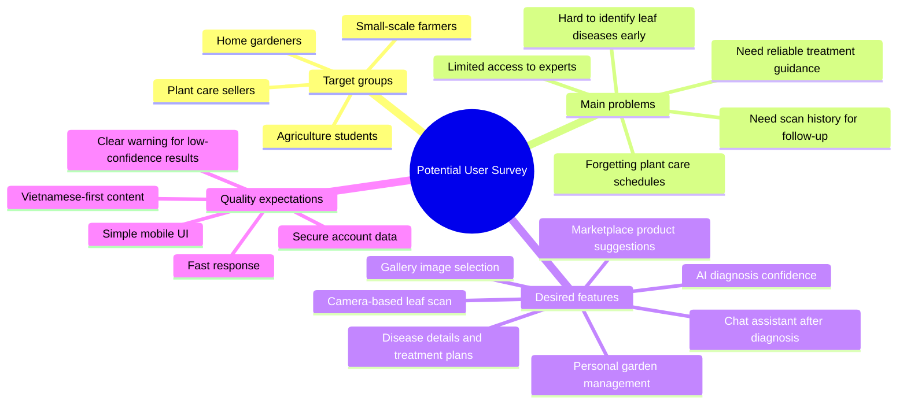

### 2.1.2 System Actors

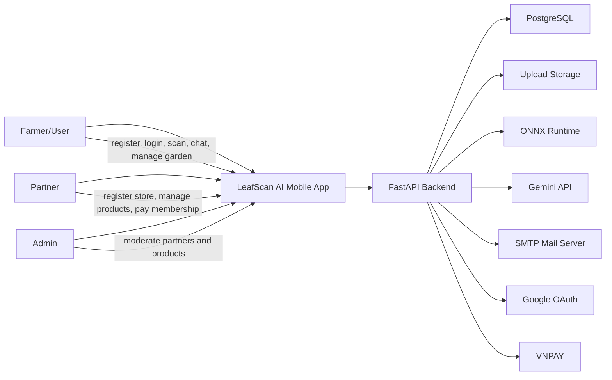

### 2.1.2.1 Overall Use-Case Diagram

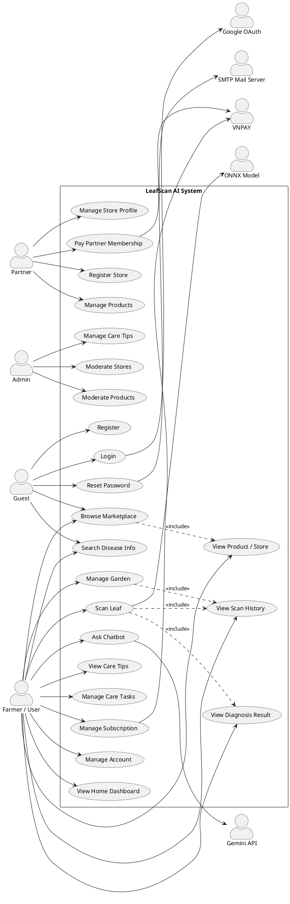

### 2.1.3 Detailed Functional Requirements

```mermaid
requirementDiagram
    functionalRequirement auth {
        id: FR_01
        text: Users shall register, log in, use JWT authentication, reset passwords with OTP, and optionally use Google OAuth.
        risk: high
        verifymethod: test
    }

    functionalRequirement garden {
        id: FR_02
        text: Users shall create, update, view, delete, and upload images for plants in My Garden.
        risk: medium
        verifymethod: test
    }

    functionalRequirement diagnosis {
        id: FR_03
        text: Users shall capture or select leaf images and receive AI disease diagnosis, confidence, stage forecast, and treatment plan.
        risk: high
        verifymethod: test
    }

    functionalRequirement history {
        id: FR_04
        text: Users shall view scan history globally and by plant.
        risk: medium
        verifymethod: test
    }

    functionalRequirement diseaseManual {
        id: FR_05
        text: Users shall search disease information and view detailed symptoms, causes, treatment, and prevention.
        risk: medium
        verifymethod: test
    }

    functionalRequirement chat {
        id: FR_06
        text: Users shall ask disease-care questions through a RAG chatbot with Gemini and streaming support.
        risk: medium
        verifymethod: test
    }

    functionalRequirement subscription {
        id: FR_07
        text: Users shall view scan quota, pay for subscription plans through VNPAY, and have scan consumption tracked.
        risk: high
        verifymethod: test
    }

    functionalRequirement marketplace {
        id: FR_08
        text: Partners shall register stores, pay membership fees, manage products, and expose approved products in the marketplace.
        risk: high
        verifymethod: test
    }

    functionalRequirement admin {
        id: FR_09
        text: Admin users shall approve or reject partner stores and partner products.
        risk: high
        verifymethod: test
    }

    element MobileApp {
        type: software
    }

    element BackendAPI {
        type: software
    }

    MobileApp - satisfies -> auth
    MobileApp - satisfies -> garden
    MobileApp - satisfies -> diagnosis
    BackendAPI - satisfies -> history
    BackendAPI - satisfies -> diseaseManual
    BackendAPI - satisfies -> chat
    BackendAPI - satisfies -> subscription
    BackendAPI - satisfies -> marketplace
    BackendAPI - satisfies -> admin
```

### 2.1.4 Non-Functional Requirements

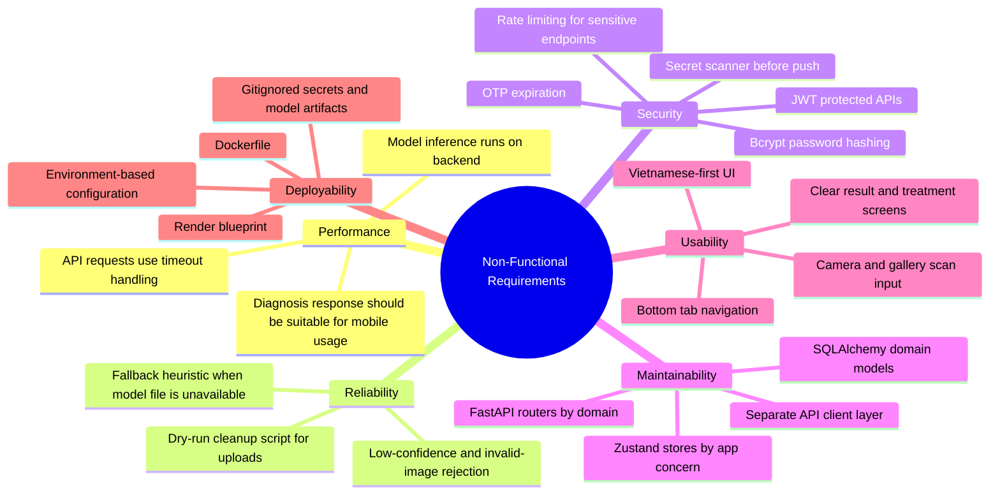

## 2.2 System Architecture Design

### 2.2.1 Three-Tier Overall Architecture

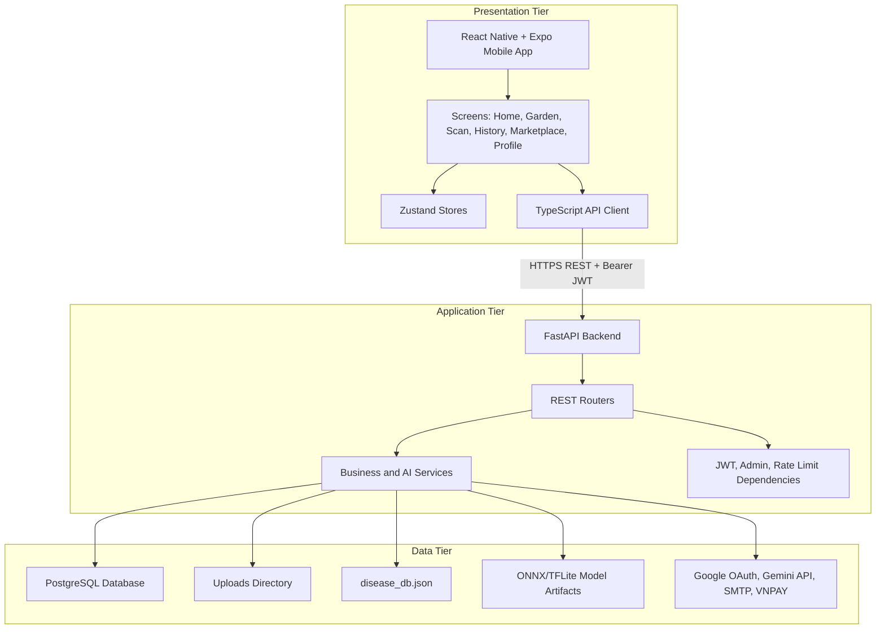

### 2.2.2 Backend Service And Module Architecture

```mermaid
flowchart TB
    FastAPI["app.main FastAPI"] --> AuthRouter["Auth Router"]
    FastAPI --> DiagnosisRouter["Diagnosis Router"]
    FastAPI --> PlantsRouter["Plants Router"]
    FastAPI --> HistoryRouter["History Router"]
    FastAPI --> DiseasesRouter["Diseases Router"]
    FastAPI --> CareTipsRouter["Care Tips Router"]
    FastAPI --> HomeRouter["Home Router"]
    FastAPI --> ChatRouter["Chat Router"]
    FastAPI --> PartnersRouter["Partners Router"]
    FastAPI --> SubscriptionsRouter["Subscriptions Router"]

    AuthRouter --> Security["security.py: bcrypt + JWT"]
    AuthRouter --> EmailService["email_service.py"]
    AuthRouter --> GoogleOAuth["Google OAuth verification"]

    DiagnosisRouter --> ImageValidation["image_validation.py"]
    DiagnosisRouter --> ModelService["model_service.py"]
    DiagnosisRouter --> PlantScope["plant_scope_validator.py"]
    DiagnosisRouter --> StageService["stage_service.py"]
    DiagnosisRouter --> TreatmentService["treatment_service.py"]
    DiagnosisRouter --> SubscriptionService["subscription_service.py"]

    ChatRouter --> RAGService["rag_service.py"]
    HomeRouter --> CareTaskLog["CareTask and CareLog services in router"]
    PartnersRouter --> VNPAYService["vnpay_service.py"]
    SubscriptionsRouter --> SubscriptionService

    Security --> Database["SQLAlchemy Session"]
    EmailService --> SMTP["SMTP Mail Server"]
    GoogleOAuth --> Google["Google OAuth"]
    ModelService --> ONNX["ONNX Runtime"]
    RAGService --> Gemini["Gemini API"]
    VNPAYService --> VNPAY["VNPAY"]
    Database --> PostgreSQL["PostgreSQL"]
```

### 2.2.3 RESTful API Map

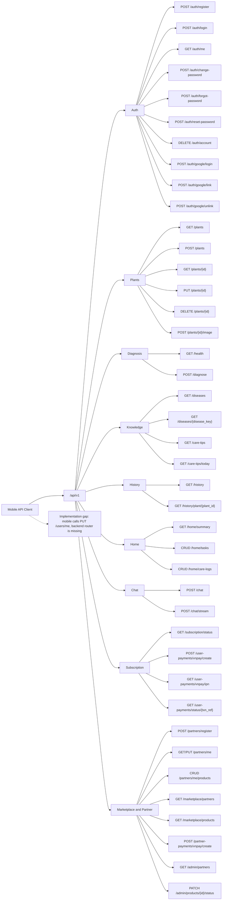

## 2.3 Database Design

### 2.3.1 Full ERD From Current SQLAlchemy Models

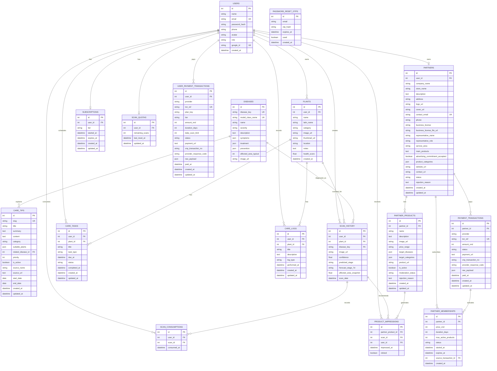

### 2.3.2 Compact Core ERD For Thesis Readability

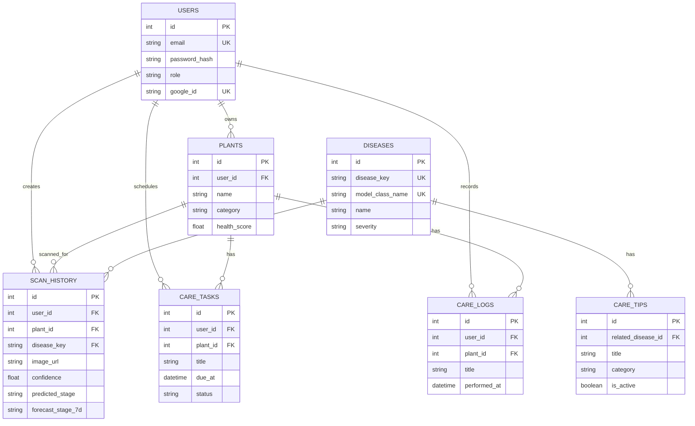

### 2.3.3 Marketplace, Subscription, And Payment ERD Extension

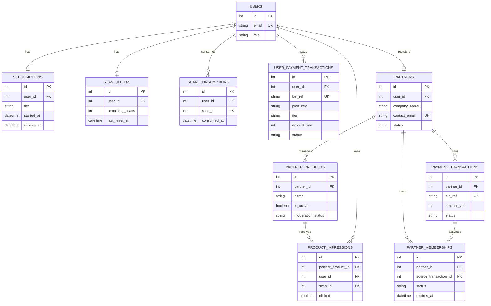

## 2.4 Detailed Use Case Design

### 2.4.1 Overall Use Case Diagram

```mermaid
flowchart LR
    Farmer["Farmer/User"]
    Partner["Partner"]
    Admin["Admin"]
    Google["Google OAuth"]
    Gemini["Gemini API"]
    SMTP["SMTP Mail Server"]
    VNPAY["VNPAY"]

    subgraph System["LeafScan AI System"]
        UC01(("UC-01 Register account"))
        UC02(("UC-02 Login"))
        UC03(("UC-03 Logout"))
        UC04(("UC-04 Update profile"))
        UC05(("UC-05 Capture leaf image"))
        UC06(("UC-06 Select leaf image"))
        UC07(("UC-07 Receive AI diagnosis"))
        UC08(("UC-08 View disease information"))
        UC09(("UC-09 View treatment plan"))
        UC10(("UC-10 View scan history"))
        UC11(("UC-11 Filter/search history"))
        UC12(("UC-12 View plant scan history"))
        UC13(("UC-13 Browse disease manual"))
        UC14(("UC-14 Search disease manual"))
        UC15(("Subscribe and pay for scan quota"))
        UC16(("Chat with RAG assistant"))
        UC17(("Register partner channel"))
        UC18(("Manage partner products"))
        UC19(("Moderate partner/product"))
        UC20(("Browse marketplace"))
    end

    Farmer --> UC01
    Farmer --> UC02
    Farmer --> UC03
    Farmer --> UC04
    Farmer --> UC05
    Farmer --> UC06
    Farmer --> UC07
    Farmer --> UC08
    Farmer --> UC09
    Farmer --> UC10
    Farmer --> UC11
    Farmer --> UC12
    Farmer --> UC13
    Farmer --> UC14
    Farmer --> UC15
    Farmer --> UC16
    Farmer --> UC20

    Partner --> UC02
    Partner --> UC17
    Partner --> UC18
    Partner --> UC20

    Admin --> UC19

    Google --> UC02
    SMTP --> UC01
    SMTP --> UC02
    Gemini --> UC16
    VNPAY --> UC15
    VNPAY --> UC17
```

### 2.4.2 UC-01 To UC-04 Account And Profile Flows

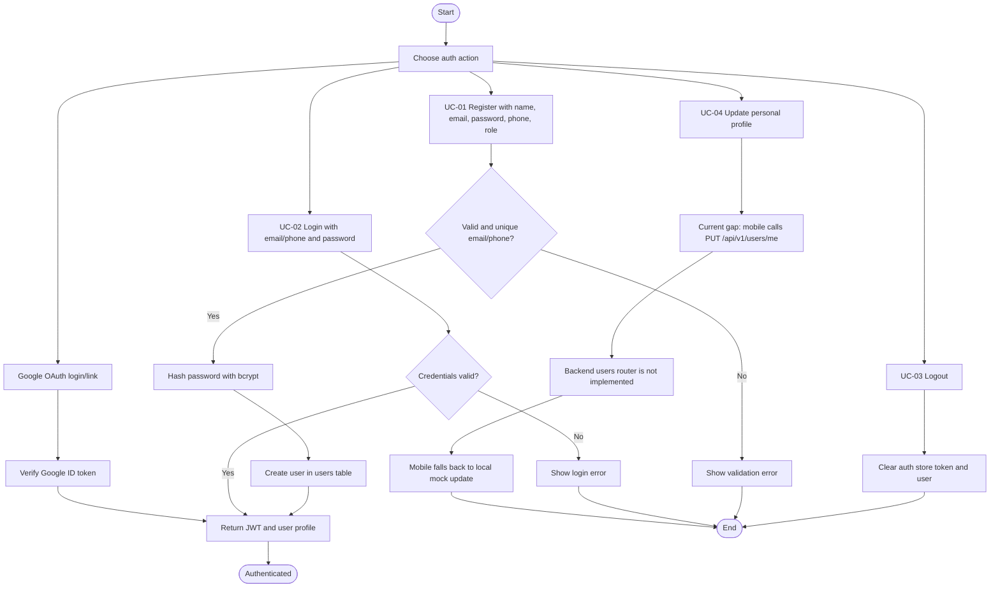

### 2.4.3 UC-05 To UC-09 Scan, Diagnosis, Disease Detail, And Treatment

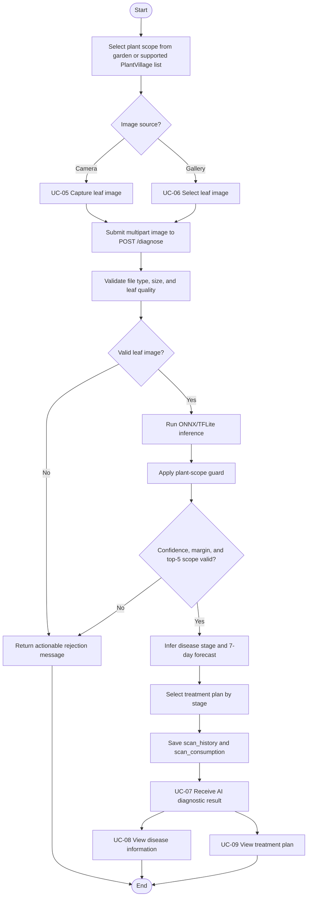

### 2.4.4 UC-10 To UC-14 History And Disease Manual

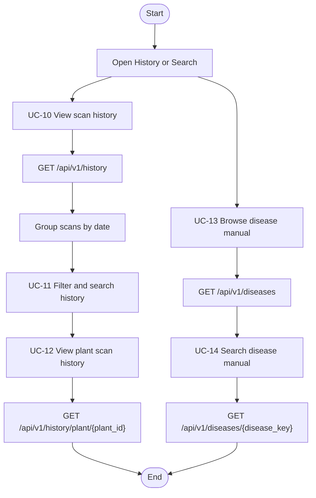

### 2.4.5 Extra Use Cases Beyond The Original TOC

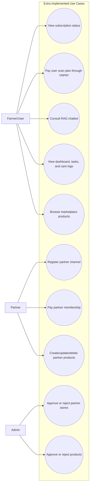

## 2.5 Activity Diagrams

### 2.5.1 Activity Diagram - Scanning And Diagnosis Process

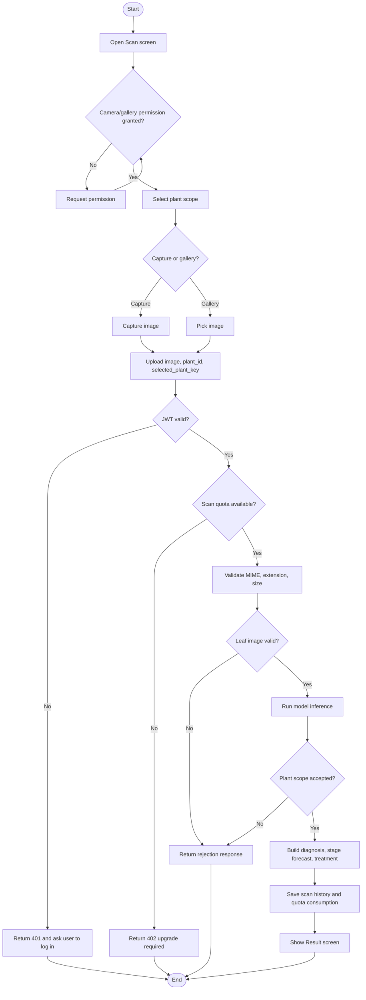

### 2.5.2 Activity Diagram - User Authentication And JWT

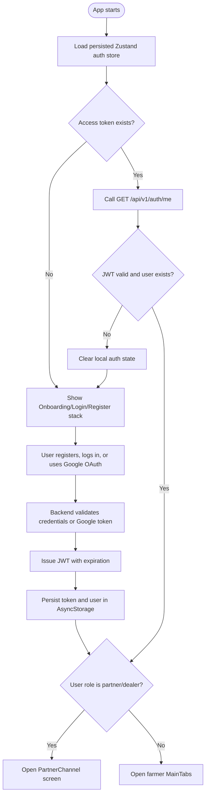

### 2.5.3 Activity Diagram - Partner Registration And Product Moderation

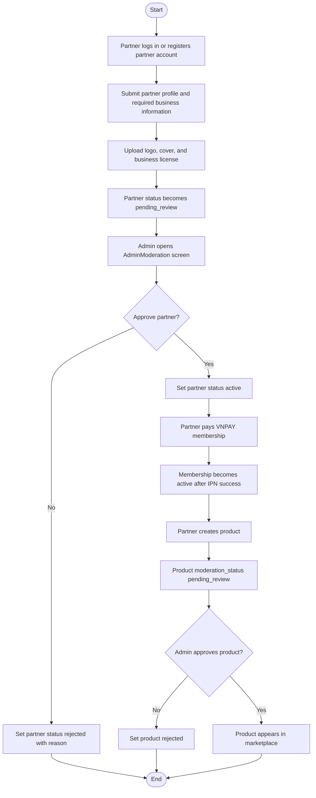

### 2.5.4 Activity Diagram - VNPAY Subscription Payment

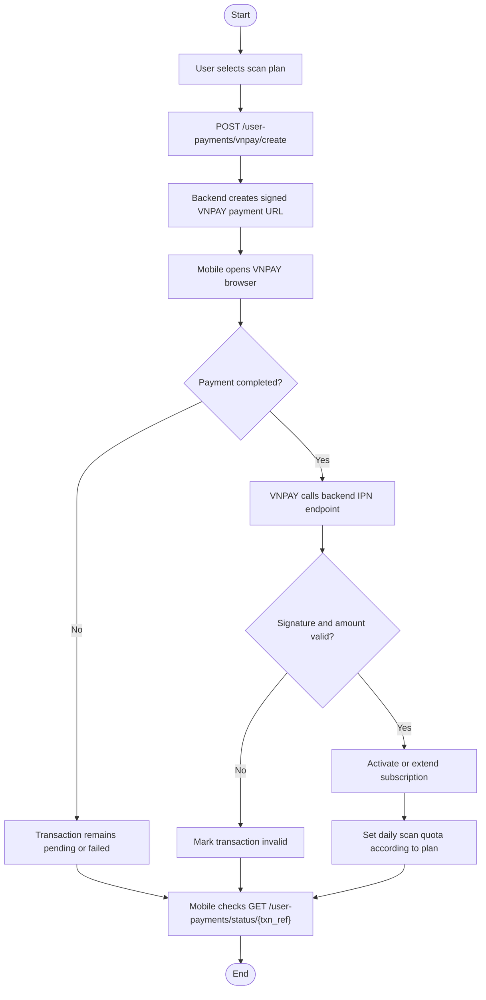

## 2.6 Sequence Diagrams

### 2.6.1 Sequence Diagram - Complete Disease Diagnosis Flow

```mermaid
sequenceDiagram
    autonumber
    actor U as Farmer/User
    participant App as Mobile App
    participant API as FastAPI Backend
    participant Auth as JWT Dependency
    participant Quota as Subscription Service
    participant Img as Image Validation
    participant Model as ONNX Runtime
    participant Scope as Plant Scope Guard
    participant Stage as Stage Service
    participant DB as PostgreSQL

    U->>App: Capture or select leaf image
    App->>API: POST /api/v1/diagnose with Bearer JWT and multipart image
    API->>Auth: Validate JWT
    Auth-->>API: Current user
    API->>Quota: ensure_can_scan(user_id)
    Quota->>DB: Read subscription and scan quota
    DB-->>Quota: Quota status
    Quota-->>API: Allowed
    API->>API: Save upload file
    API->>Img: Validate leaf quality
    Img-->>API: Metrics and validation result
    alt Invalid image
        API-->>App: success=false with rejection reason
        App-->>U: Show guidance to rescan
    else Valid image
        API->>Model: Predict top classes
        Model-->>API: Top-k predictions
        API->>Scope: Validate confidence, margin, selected plant
        Scope-->>API: Scope result
        alt Scope rejected
            API-->>App: success=false low-confidence or out-of-scope message
        else Scope accepted
            API->>DB: Resolve disease by model_class_name
            API->>Stage: Infer stage and forecast 7 days
            Stage->>DB: Read user/plant scan history
            DB-->>Stage: Previous scan context
            Stage-->>API: Stage, forecast, treatment plan
            API->>DB: Insert scan_history and scan_consumption
            DB-->>API: Commit success
            API-->>App: Diagnosis response
            App-->>U: Show result, treatment, and chat entry
        end
    end
```

### 2.6.2 Sequence Diagram - JWT Authentication Flow When App Starts

```mermaid
sequenceDiagram
    autonumber
    participant App as Mobile App
    participant Store as Zustand Auth Store
    participant API as FastAPI Backend
    participant Auth as JWT Dependency
    participant DB as PostgreSQL

    App->>Store: Load persisted auth-storage
    Store-->>App: accessToken and user, if present
    alt Token missing
        App->>App: Render auth stack
    else Token exists
        App->>API: GET /api/v1/auth/me with Bearer JWT
        API->>Auth: Decode and verify JWT
        Auth->>DB: Find user by subject
        DB-->>Auth: User record
        Auth-->>API: Current user
        API-->>App: User profile
        App->>Store: Update user and isLoggedIn=true
        alt role is partner or dealer
            App->>App: Open PartnerChannel
        else farmer role
            App->>App: Open MainTabs
        end
    end
```

### 2.6.3 Sequence Diagram - RAG Chatbot Flow

```mermaid
sequenceDiagram
    autonumber
    actor U as Farmer/User
    participant App as Chat Screen
    participant API as Chat Router
    participant Auth as JWT Dependency
    participant RAG as RAG Service
    participant KB as disease_db.json
    participant Gemini as Gemini API

    U->>App: Ask disease-care question
    App->>API: POST /api/v1/chat/stream or /chat
    API->>Auth: Validate JWT
    Auth-->>API: Current user
    API->>RAG: Build context from disease key, confidence, history
    RAG->>KB: Retrieve disease chunks
    KB-->>RAG: Relevant context
    RAG->>Gemini: Generate answer with guarded prompt
    alt Streaming request
        Gemini-->>RAG: Partial tokens
        RAG-->>API: SSE chunks
        API-->>App: data chunks
        App-->>U: Append assistant response
    else Non-streaming request
        Gemini-->>RAG: Full answer
        RAG-->>API: Reply text
        API-->>App: JSON reply
        App-->>U: Show assistant response
    end
```

### 2.6.4 Sequence Diagram - VNPAY Payment And IPN Callback Flow

```mermaid
sequenceDiagram
    autonumber
    actor U as Farmer/User
    participant App as Mobile App
    participant API as FastAPI Backend
    participant Pay as VNPAY Service
    participant VNPAY as VNPAY
    participant DB as PostgreSQL

    U->>App: Select paid scan plan
    App->>API: POST /api/v1/user-payments/vnpay/create
    API->>Pay: Build signed payment URL
    Pay-->>API: Payment URL and transaction reference
    API->>DB: Insert user_payment_transactions pending
    DB-->>API: Commit
    API-->>App: payment_url, txn_ref
    App->>VNPAY: Open payment URL in browser
    U->>VNPAY: Complete payment
    VNPAY->>API: GET /api/v1/user-payments/vnpay/ipn
    API->>Pay: Verify secure hash
    Pay-->>API: Signature result
    alt Valid payment
        API->>DB: Mark transaction success
        API->>DB: Activate subscription and update scan quota
        API-->>VNPAY: RspCode 00
    else Invalid payment
        API->>DB: Mark transaction invalid or failed
        API-->>VNPAY: Error response code
    end
    App->>API: GET /api/v1/user-payments/status/{txn_ref}
    API->>DB: Read transaction
    DB-->>API: Current payment status
    API-->>App: Status and plan details
```

### 2.6.5 Sequence Diagram - Admin Moderation Flow

```mermaid
sequenceDiagram
    autonumber
    actor Admin as Admin
    participant App as AdminModerationScreen
    participant API as FastAPI Backend
    participant Guard as require_admin
    participant DB as PostgreSQL
    participant Partner as Partner

    Admin->>App: Open moderation screen
    App->>API: GET /api/v1/admin/partners?status=pending_review
    API->>Guard: Check email in ADMIN_EMAILS
    Guard-->>API: Admin allowed
    API->>DB: Query partners
    DB-->>API: Pending partners
    API-->>App: Partner list

    App->>API: GET /api/v1/admin/products?status=pending_review
    API->>Guard: Check admin permission
    API->>DB: Query products
    DB-->>API: Pending products
    API-->>App: Product list

    Admin->>App: Approve or reject item
    App->>API: PATCH admin status endpoint
    API->>Guard: Check admin permission
    API->>DB: Update partner/product status
    DB-->>API: Commit success
    API-->>App: Updated record
    App-->>Partner: Result visible after refresh
```

## 2.7 User Interface And UX Design

### 2.7.1 Mobile Navigation Flow

```mermaid
flowchart TD
    Launch["App launch"] --> AuthState{"isLoggedIn?"}
    AuthState -- No --> Onboarding["Onboarding"]
    Onboarding --> Login["Login"]
    Onboarding --> Register["Register"]
    Login --> Forgot["ForgotPassword"]
    Register --> MainDecision{"Authenticated role?"}
    Login --> MainDecision

    AuthState -- Yes --> MainDecision
    MainDecision -- Partner or Dealer --> PartnerChannel["PartnerChannel"]
    MainDecision -- Farmer/User --> MainTabs["MainTabs"]

    MainTabs --> Home["Home"]
    MainTabs --> Garden["MyGarden"]
    MainTabs --> ScanTab["Scan"]
    MainTabs --> Marketplace["Marketplace"]
    MainTabs --> Profile["Profile"]

    Home --> Search["Search"]
    Home --> DiseaseDetail["DiseaseDetail"]
    Garden --> PlantDetail["PlantDetail"]
    Garden --> AddPlant["AddPlant"]
    PlantDetail --> EditPlant["EditPlant"]
    ScanTab --> Result["Result"]
    Result --> Chat["Chat"]
    Result --> DiseaseDetail
    Profile --> EditProfile["EditProfile"]
    Profile --> ChangePassword["ChangePassword"]
    Profile --> History["History"]
    Profile --> UpgradePlan["UpgradePlan"]
    Profile --> Privacy["PrivacyPolicy"]
    Profile --> Terms["TermsOfUse"]
    Marketplace --> PartnerStore["PartnerStore"]
    Marketplace --> PartnerProductDetail["PartnerProductDetail"]
    PartnerChannel --> AdminModeration["AdminModeration"]
```

### 2.7.2 Farmer Bottom Tab Navigation

```mermaid
flowchart LR
    MainTabs["Farmer MainTabs"] --> Home["Home tab<br/>Dashboard, tips, recent scans"]
    MainTabs --> Garden["Garden tab<br/>Plant CRUD and health summary"]
    MainTabs --> Scan["Scan center action<br/>Camera and gallery diagnosis"]
    MainTabs --> Marketplace["Marketplace tab<br/>Approved partner products"]
    MainTabs --> Profile["Profile tab<br/>Account, settings, security"]

    Home --> Tasks["Care tasks and care logs"]
    Garden --> PlantDetail["Plant detail and plant history"]
    Scan --> Result["Diagnosis result"]
    Result --> Chat["RAG chat"]
    Marketplace --> Store["Partner store detail"]
    Profile --> Upgrade["Subscription upgrade"]
```

### 2.7.3 Partner And Admin Navigation Extension

```mermaid
flowchart TD
    PartnerLogin["Partner login or partner role"] --> PartnerChannel["PartnerChannelScreen"]
    PartnerChannel --> ProfileForm["Store profile and review information"]
    PartnerChannel --> Documents["Logo, cover, business license uploads"]
    PartnerChannel --> PartnerPayment["VNPAY partner membership payment"]
    PartnerChannel --> ProductCRUD["Product create, update, delete, image upload"]
    ProductCRUD --> PendingReview["Products wait for admin approval"]

    AdminEntry["Admin route"] --> AdminModeration["AdminModerationScreen"]
    AdminModeration --> PartnerReview["Review pending partners"]
    AdminModeration --> ProductReview["Review pending products"]
    PartnerReview --> ApproveRejectPartner["Approve or reject partner"]
    ProductReview --> ApproveRejectProduct["Approve or reject product"]
```

## 2.8 AI Model Design

### 2.8.1 EfficientNetV2-S Training And Export Pipeline

```mermaid
flowchart TD
    Dataset["PlantVillage 38-class dataset"] --> Split["Train/validation split"]
    Split --> Preprocess["Resize, crop, normalize, augment"]
    Preprocess --> Backbone["EfficientNetV2-S backbone"]
    Backbone --> FineTune["Fine-tune classifier head and selected layers"]
    FineTune --> Checkpoint["Save best PyTorch checkpoint .pth"]
    Checkpoint --> Evaluate["Evaluate accuracy and confusion patterns"]
    Evaluate --> Export["Export to ONNX"]
    Export --> ValidateONNX["Validate ONNX batch inference"]
    ValidateONNX --> Calibration["Optional temperature scaling calibration.json"]
    Calibration --> DeployArtifact["Deploy model artifact through MODEL_PATH"]
```

### 2.8.2 Backend Inference Pipeline

```mermaid
flowchart TD
    Upload["POST /api/v1/diagnose image upload"] --> FileGuard["MIME, extension, size validation"]
    FileGuard --> Save["Save uploaded image"]
    Save --> LeafGuard["Leaf validation: green ratio, brightness, blur, component density"]
    LeafGuard --> IsLeaf{"Leaf accepted?"}
    IsLeaf -- No --> Reject["Return success=false with guidance"]
    IsLeaf -- Yes --> Preprocess["Center crop, resize 224x224, ImageNet normalization"]
    Preprocess --> BackendChoice{"Model backend available?"}
    BackendChoice -- ONNX --> ONNX["ONNX Runtime inference with TTA flip"]
    BackendChoice -- TFLite --> TFLite["TFLite interpreter inference"]
    BackendChoice -- Missing --> Heuristic["Deterministic heuristic fallback"]
    ONNX --> Softmax["Temperature-scaled softmax"]
    TFLite --> Softmax
    Heuristic --> Softmax
    Softmax --> TopK["Top-k predictions"]
    TopK --> Scope["Plant-scope validation: top-1 confidence, margin, top-5 same-plant count"]
    Scope --> ScopeOK{"Scope accepted?"}
    ScopeOK -- No --> Reject
    ScopeOK -- Yes --> DiseaseMap["Map model_class_name to disease record"]
    DiseaseMap --> Stage["Infer current stage and 7-day forecast"]
    Stage --> Treatment["Select treatment plan by stage"]
    Treatment --> Persist["Persist scan_history and scan_consumption"]
    Persist --> Response["Return diagnosis response"]
```

## 2.9 System Security Design

### 2.9.1 Security Architecture

```mermaid
flowchart TB
    Mobile["Mobile App"] -->|HTTPS REST| API["FastAPI Backend"]

    subgraph Identity["Identity And Access"]
        RegisterLogin["Register/Login"]
        JWT["JWT access token"]
        Google["Google OAuth ID token verification"]
        AdminAllowlist["ADMIN_EMAILS allowlist"]
    end

    subgraph CredentialSecurity["Credential Security"]
        Bcrypt["SHA-256 prehash + bcrypt"]
        OTP["Password reset OTP hash and expiration"]
        SMTP["SMTP Mail Server"]
    end

    subgraph RuntimeProtection["Runtime Protection"]
        RateLimit["In-process rate limiting"]
        UploadValidation["File and leaf-image validation"]
        CORS["CORS configuration"]
        RequestID["Request logging with X-Request-ID"]
    end

    subgraph SecretOps["Secret And Deployment Operations"]
        Env[".env and environment variables"]
        Gitignore["Gitignored secrets, uploads, models"]
        Scanner["scripts/scan_secrets.sh"]
        Docker["Docker and Render env vars"]
    end

    API --> RegisterLogin
    RegisterLogin --> JWT
    RegisterLogin --> Bcrypt
    RegisterLogin --> Google
    RegisterLogin --> OTP
    OTP --> SMTP
    API --> RateLimit
    API --> UploadValidation
    API --> CORS
    API --> RequestID
    API --> AdminAllowlist
    API --> Env
    Env --> Gitignore
    Gitignore --> Scanner
    Env --> Docker
```

### 2.9.2 Threat And Control Map

```mermaid
mindmap
  root((Security Threats And Controls))
    Account takeover
      Bcrypt password hashing
      JWT expiration
      Password reset OTP expiration
      Google ID token verification
    Brute force
      Rate limit login
      Rate limit OTP
      Rate limit chat
    Unauthorized admin access
      ADMIN_EMAILS allowlist
      require_admin dependency
      Bearer JWT required
    Invalid or malicious uploads
      MIME and extension validation
      Max file size
      Leaf image validation
      Upload cleanup CLI
    Secret leakage
      Gitignore .env files
      Secret scanner
      History rewrite documentation
      Render dashboard secret variables
    AI misuse or overconfidence
      Low-confidence rejection
      Plant-scope guard
      Safety notice in treatment output
      Chat prompt downgrade for low confidence
```

## Chapter 3 Application Implementation And Evaluation

### 3.1 Development Environment And Tools Setup

```mermaid
flowchart LR
    Dev["Developer Workstation"] --> BackendEnv["Python 3.12 virtualenv"]
    Dev --> MobileEnv["Node.js, npm, Expo CLI"]
    Dev --> DB["PostgreSQL"]
    Dev --> ModelArtifacts["ONNX/PyTorch model artifacts"]

    BackendEnv --> FastAPI["FastAPI + Uvicorn"]
    BackendEnv --> Pytest["Pytest + Hypothesis"]
    BackendEnv --> SQLAlchemy["SQLAlchemy"]
    BackendEnv --> ONNXRuntime["ONNX Runtime"]

    MobileEnv --> Expo["Expo SDK 54"]
    MobileEnv --> RN["React Native 0.81"]
    MobileEnv --> TypeScript["TypeScript"]
    MobileEnv --> Zustand["Zustand"]

    Dev --> Git["Git"]
    Git --> SecretScanner["scripts/scan_secrets.sh"]
    Git --> Docker["backend/Dockerfile"]
    Docker --> Render["backend/render.yaml"]
```

### 3.2 Backend Implementation Modules

```mermaid
flowchart TB
    Backend["backend/app"] --> Main["main.py<br/>FastAPI app, CORS, router registration, uploads mount"]
    Backend --> Config["config.py<br/>Env and thresholds"]
    Backend --> Database["database.py<br/>SQLAlchemy engine, schema ensure, seed"]
    Backend --> Models["models/domain.py<br/>Database tables"]
    Backend --> Schemas["schemas/<br/>Pydantic contracts"]
    Backend --> Routers["routers/<br/>REST endpoints"]
    Backend --> Services["services/<br/>AI, RAG, treatment, payment, email"]
    Backend --> Dependencies["dependencies/<br/>JWT, admin, rate limit"]
    Backend --> Utils["utils/security.py<br/>bcrypt and JWT"]

    Routers --> Auth["auth.py"]
    Routers --> Diagnosis["diagnosis.py"]
    Routers --> Plants["plants.py"]
    Routers --> History["history.py"]
    Routers --> Diseases["diseases.py"]
    Routers --> Chat["chat.py"]
    Routers --> Home["home.py"]
    Routers --> Partners["partners.py"]
    Routers --> Subscriptions["subscriptions.py"]

    Services --> ModelService["model_service.py"]
    Services --> RAG["rag_service.py"]
    Services --> Stage["stage_service.py"]
    Services --> VNPAY["vnpay_service.py"]
    Services --> Email["email_service.py"]
```

### 3.3 Mobile Implementation Modules

```mermaid
flowchart TB
    Mobile["leafscan-ai"] --> App["App.tsx"]
    App --> Navigation["navigation/<br/>AppNavigator and BottomTabNavigator"]
    App --> Theme["theme/<br/>ThemeProvider and theme tokens"]
    App --> I18N["i18n/<br/>vi/en resources"]

    Mobile --> Screens["screens/"]
    Screens --> AuthScreens["Login, Register, ForgotPassword"]
    Screens --> MainScreens["Home, MyGarden, Scan, History, Profile"]
    Screens --> ResultScreens["Result, DiseaseDetail, Chat"]
    Screens --> PartnerScreens["Marketplace, PartnerChannel, AdminModeration"]
    Screens --> AccountScreens["EditProfile, ChangePassword, UpgradePlan"]

    Mobile --> Components["components/"]
    Components --> HomeComponents["home components"]
    Components --> GardenComponents["garden components"]
    Components --> ScanComponents["scan components"]
    Components --> ProfileComponents["profile components"]

    Mobile --> Stores["stores/"]
    Stores --> AuthStore["authStore"]
    Stores --> PlantsStore["plantsStore"]
    Stores --> HistoryStore["historyStore"]
    Stores --> SettingsStore["settingsStore"]

    Mobile --> API["api/"]
    API --> Client["client.ts"]
    API --> AuthAPI["auth, google-auth, account"]
    API --> DomainAPI["diagnosis, plants, history, diseases, home, chat"]
    API --> CommerceAPI["marketplace, subscription"]
```

### 3.4 Testing And Quality Assurance Pipeline

```mermaid
flowchart LR
    Code["Source code"] --> SecretScan["bash scripts/scan_secrets.sh"]
    Code --> BackendTests["backend: pytest tests/"]
    Code --> MobileTypecheck["mobile: npm run lint (tsc --noEmit)"]
    Code --> ManualModelTests["manual AI scripts in backend/scripts"]
    Code --> CleanupDryRun["cleanup_uploads.py --dry-run"]

    BackendTests --> AuthTests["Auth endpoint tests"]
    BackendTests --> HomeTests["Home dashboard tests"]
    BackendTests --> MarketplaceTests["Partner marketplace and VNPAY tests"]
    BackendTests --> SubscriptionTests["User subscription and quota tests"]
    BackendTests --> ScannerTests["Secret scanner property tests"]
    BackendTests --> CleanupTests["Upload cleanup CLI tests"]

    SecretScan --> QualityGate["Quality gate before push"]
    BackendTests --> QualityGate
    MobileTypecheck --> QualityGate
    CleanupDryRun --> QualityGate
    ManualModelTests --> Evaluation["Model and API evaluation evidence"]
```

### 3.5 Deployment Architecture

```mermaid
flowchart TB
    Repo["GitHub Repository"] --> RenderBlueprint["backend/render.yaml"]
    RenderBlueprint --> WebService["Render Web Service<br/>Docker runtime"]
    RenderBlueprint --> ManagedDB["Render PostgreSQL"]
    WebService --> Dockerfile["backend/Dockerfile"]
    Dockerfile --> Runtime["Uvicorn FastAPI runtime"]
    Runtime --> ManagedDB
    Runtime --> Env["Render environment variables"]
    Runtime --> Uploads["Container uploads directory"]
    Runtime --> External["Gemini API, SMTP, Google OAuth, VNPAY"]

    MobileBuild["Expo mobile app"] --> PublicAPI["EXPO_PUBLIC_API_BASE_URL"]
    PublicAPI --> WebService

    Env --> Secrets["SECRET_KEY, DATABASE_URL, GEMINI_API_KEY, SMTP, GOOGLE_CLIENT_ID, VNPAY"]
    Env --> ModelPath["MODEL_PATH for deployed model artifact"]
```
